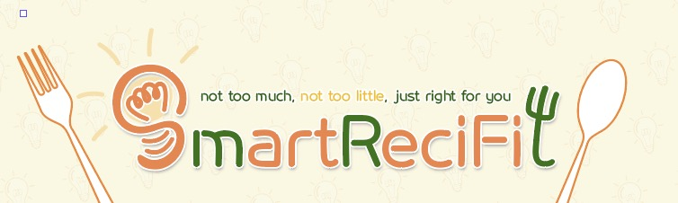

# 🍴 SmartReciFit  

  

# 🧠 Smart Recipe & Fitness Service (SmartReciFit)
AI 기반 레시피 데이터 정제 & 요약 플랫폼  
*(2025.03.11 ~ 2025.03.31 | 21 days)*

SmartReciFit은 개인의 식습관과 영양 정보를 기반으로  
**AI를 활용해 레시피 데이터를 정제·요약·구조화**하고,  
이를 바탕으로 맞춤형 레시피를 제공하는 요리 레시피 웹/모바일 서비스입니다.

외부 레시피 API와 YouTube 요리 영상의 **비정형 데이터**를  
AI로 1차 가공한 뒤, 서버 단에서 검증·통합하여  
**실제 서비스에서 재사용 가능한 데이터 자산**으로 변환하는 것을 핵심 목표로 합니다.

---

## 🌟 Key Highlights (차별화 포인트)

### 🤖 AI 기반 레시피 데이터 정제 파이프라인
- 외부 레시피 API 데이터의 **재료·양념 혼재 문제 해결**
- AI(Gemini API)를 활용하여:
  - 재료 / 양념 자동 분리
  - 조리 방법, 소요 시간, 난이도 등 태그 자동 생성
- AI 응답을 **서버(Java)에서 검증·보정 후 DB 저장**
- 프롬프트 의존도를 낮춘 **안정적인 AI 활용 구조 설계**

> AI 응답을 일회성 결과가 아닌,  
> **검색·추천에 활용 가능한 서비스 데이터로 전환**

---

### 🎥 AI 기반 YouTube 레시피 요약
- YouTube 요리 영상 URL 입력 시:
  - 영상 핵심 조리 과정 자동 요약
  - 불필요한 설명 제거 및 단계별 레시피 정제
- 영상별 자막 유무 차이를 고려한 예외 처리 설계
- 초보자도 빠르게 이해 가능한 요약 레시피 제공

---

### 🥗 개인 맞춤 레시피 추천
- 칼로리 및 영양소 기준 맞춤 추천
- 다이어트·건강 관리 목적별 식단 제공
- AI로 정제된 태그 데이터를 기반으로 검색 정확도 향상

---

## 🧩 Main Features

- 📋 레시피 게시판  
  레시피 검색, 열람, 즐겨찾기 기능 제공

- ⭐ 후기 & 커뮤니티  
  후기 작성, 댓글 및 좋아요 기능을 통한 사용자 소통

- ⚖️ 정확한 재료 계량 정보  
  g / ml 단위의 정량 정보 제공으로 요리 진입 장벽 감소

---

## 🧠 AI Demo

---

## 👨‍💻 My Responsibilities

### 🤖 AI & Data Processing
- Python 기반 AI 데이터 정제 로직 구현
- Gemini API 연동 및 프롬프트 설계
- AI 결과를 그대로 사용하지 않고,
  **서버 단 검증·보정 로직을 포함한 2단계 처리 구조 설계**
- 영상별 자막 유무에 따른 예외 처리 경험

---

### 🔐 User & Account
- 사용자 CRUD
- 로컬 로그인 / 로그아웃
- 아이디 찾기 / 비밀번호 찾기 기능 구현

---

### 🛠️ Member & Admin
- 회원 관리 기능
- 계정 전환 로직
- 관리자 페이지 구현

---

### 🤝 Collaboration
- 코드 리뷰 참여
- request / response 구조 개선
- 프론트엔드–백엔드 데이터 흐름 통합 관리

---

## 🛠️ Tech Stack

### 💻 Backend / Server
- Java
- JSP
- MyBatis
- Apache Tomcat

### 🤖 AI / Data Processing
- Python
- Gemini API
- Prompt Engineering
- AI 응답 검증 및 데이터 정제 로직

### 🗄️ Database
- MySQL

### 🎨 Frontend
- HTML
- CSS
- JavaScript

---

## 📌 Project Summary

- AI를 활용한 **레시피 데이터 정제 및 요약 시스템 구현**
- 프롬프트 + 서버 검증을 결합한 안정적인 AI 활용 구조 설계
- 개인 맞춤 식단 추천을 위한 구조화 데이터 확보
- 팀 협업 기반 백엔드 중심 프로젝트 경험

---

## 🔗 Links
- 💻 GitHub Repository  
  👉 https://github.com/knk06/SmartReciFit

- 📒 Daily Work Log (Notion)  
  👉 https://www.notion.so/1b3362773fa48039b51cce1b62ce4a78?pvs=21
